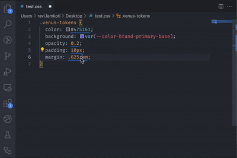

## Installation
```bash
code --install-extension <path-to-venus-design-tokens-1.0.0.vsix>
```

## Features
### 1. Linter
Identify hard-coded CSS values and receive suggestions for corresponding design tokens. This feature helps ensure your codebase is using standardized tokens, making it easier to maintain and update designs consistently.<br/>


### 2. Autocomplete
Utilize Autocomplete suggestions for design tokens.</br>


### 3. Hover Preview
See the exact value of the Design Token’s CSS custom properties on hover.</br>


### 4. Color Preview
Preview design tokens colors in the editor.</br>


### 5. Quick Fix and Fix All Action
Replace a css value with venus token with [CMD + .] or fix whole css file with [Ctrl+Shift+V] (V for venus 😉) </br>
